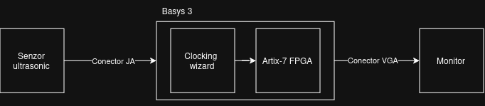
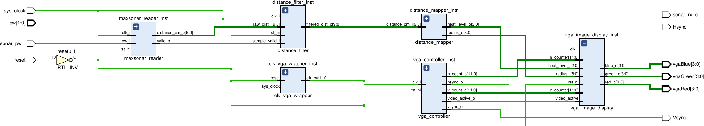

# VGA pe FPGA Xilinx Artix-7
## Autor: Toderiță Teodor
---

## Istoric Revizii

| Revizie | Data | Autor | Descriere |
| :--- | :--- | :--- | :--- |
| 0.1 | Iulie 6, 2026 | Teodor Toderiță | First draft |
| 0.2 | Iulie 10, 2026 | Teodor Toderiță | Am implementat etapele 1, 2 și 3. Am documentat progresul |
| 0.3 | Iulie 15, 2026 | Teodor Toderiță | Am integrat senzorul ultrasonic MaxSonar pe interfața PMOD și maparea grafică |
| 0.4 | Iulie 17, 2026 | Teodor Toderiță | Am integrat filtrul de medie mobilă pentru eliminarea jitter-ului vizual |
| 0.5 | Iulie 23, 2026 | Teodor Toderiță | Am optimizat modulul distance_mapper |

---

## Arhitectura Sistemului

### 1. Interfațarea Hardware

  

### 2. Schema Bloc RTL (Vivado)

  

---
- [VGA pe FPGA Xilinx Artix-7](#vga-pe-fpga-xilinx-artix-7)
  - [Autor: Toderiță Teodor](#autor-toderiță-teodor)
  - [Istoric Revizii](#istoric-revizii)
  - [Arhitectura Sistemului](#arhitectura-sistemului)
    - [1. Interfațarea Hardware](#1-interfațarea-hardware)
    - [2. Schema Bloc RTL (Vivado)](#2-schema-bloc-rtl-vivado)
  - [Obiectivele Proiectului](#obiectivele-proiectului)
    - [Obiectivul General al Proiectului](#obiectivul-general-al-proiectului)
    - [Obiective Personale](#obiective-personale)
  - [Etapele Proiectului](#etapele-proiectului)
    - [Etapa 0: Specificațiile Proiectului](#etapa-0-specificațiile-proiectului)
    - [Etapa 1: Proiectarea și Simularea Controllerului VGA (640x480)](#etapa-1-proiectarea-și-simularea-controllerului-vga-640x480)
    - [Etapa 2: Validarea Hardware și Generarea de Modele Statice](#etapa-2-validarea-hardware-și-generarea-de-modele-statice)
    - [Etapa 3: Animarea Obiectelor (Efectul „DVD Screensaver”)](#etapa-3-animarea-obiectelor-efectul-dvd-screensaver)
    - [Etapa 4: Integrarea Senzorului Ultrasonic](#etapa-4-integrarea-senzorului-ultrasonic)
    - [Etapa 5: Maparea Datelor și Randarea Grafică pe Ecran](#etapa-5-maparea-datelor-și-randarea-grafică-pe-ecran)
    - [Etapa 6: Filtrarea și Stabilizarea Semnalului (Moving Average Filter)](#etapa-6-filtrarea-și-stabilizarea-semnalului-moving-average-filter)
    - [Etapa 7: Optimizarea Logicii și Închiderea Timing-ului (Pipelining)](#etapa-7-optimizarea-logicii-și-închiderea-timing-ului-pipelining)

## Obiectivele Proiectului

### Obiectivul General al Proiectului
Obiectivul acestui proiect este proiectarea și implementarea unui controller VGA la nivel de hardware, având ca rezoluție de bază 640x480 pixeli. Proiectul presupune interfațarea unor senzori externi și utilizarea resurselor interne ale FPGA-ului pentru a afișa animații interactive și grafică dinamică pe un monitor.

### Obiective Personale
* **Aprofundarea limbajelor de descriere hardware:** Însușirea și aplicarea conceptelor de proiectare digitală prin utilizarea SystemVerilog.
* **Deprinderea bunelor practici de programare:** Scrierea unui cod modular, bine comentat și sinzetabil.
* **Stăpânirea fluxului de lucru în Vivado:** Utilizarea completă a suitei de dezvoltare Xilinx Vivado (Sinteză, Implementare, Analiză de Timing).
* **Dezvoltarea abilităților de depanare:** Învățarea tehnicilor de testare a hardware-ului, atât prin simulare, cât și direct pe placa de dezvoltare.

---

## Etapele Proiectului

### Etapa 0: Specificațiile Proiectului
* **Obiectivul etapei**: Crearea documentației inițiale a proiectului (README), planificarea etapelor de dezvoltare și studierea fișelor tehnice (datasheets) pentru parametrii de timing ai standardului VGA.
* **Realizarea etapei**: Am structurat planul de lucru și am extras valorile corecte de free-running counters (Front Porch, Back Porch, Sync Pulse) necesare rezoluției de 640x480.

### Etapa 1: Proiectarea și Simularea Controllerului VGA (640x480)
* **Obiectivul etapei**: Scrierea codului pentru semnalele de sincronizare VGA (`HSYNC`, `VSYNC`) și validarea diagramelor de timp folosind Vivado Simulator.
* **Realizarea etapei**: Am proiectat logica de control prin implementarea a două numărătoare independente pentru axa orizontală și cea verticală. Pe baza acestora, am generat semnalele `hsync_o` și `vsync_o` respectând timpii din documentația standardului VGA (Active Video, Front Porch, Sync Pulse, Back Porch). Ulterior, am validat funcționalitatea în simulator printr-un testbench, obținând diagramele de timp corecte.
* **Dificultăți întâmpinate**: Inițial, un test a eșuat deoarece culorile nu erau resetate la pornirea sistemului, rămânând cu valori nedefinite.
* **Mod de rezolvare**: Am corectat problema adăugând inițializarea culorilor pe valoarea `0` în blocul de reset.

### Etapa 2: Validarea Hardware și Generarea de Modele Statice
* **Obiectivul etapei**: Configurarea fișierului de constrângeri (`.xdc`) pentru pinii VGA ai plăcii de dezvoltare Basys 3 și afișarea unor modele statice de test (bare de culori) pe un monitor.
* **Realizarea etapei**: Am realizat un Block Design în Vivado și am integrat IP-ul Clocking Wizard pentru a genera un ceas stabil la frecvența de 25.175 MHz. Arhitectura este modulară, ceea ce permite modificarea lesne a parametrilor. În final, am mapat pinii pentru semnalele de sincronizare și culori în fișierul `.xdc`, reușind să afișez pe ecran modelul static de test.
* **Dificultăți întâmpinate**: La primul test pe placă, ecranul nu reacționa la apăsarea butonului de reset din cauză că acesta nu fusese mapat corect în fișierul de constrângeri.
* **Mod de rezolvare**: Am corectat maparea pinului corespunzător butonului de reset în fișierul `.xdc`, asigurând inițializarea corectă a controllerului VGA direct din hardware.

### Etapa 3: Animarea Obiectelor (Efectul „DVD Screensaver”)
* **Obiectivul etapei**: Implementarea logicii hardware pentru a anima o formă geometrică care se deplasează și ricoșează din marginile ecranului.
* **Realizarea etapei**: Am integrat logica de mișcare și calculul poziției direct în modulul principal al controllerului VGA, desenând un pătrat care își schimbă coordonatele la fiecare reîmprospătare de cadru.
* **Dificultăți întâmpinate**: După adăugarea unui switch pentru controlul vitezei, pătratul depășea limitele ecranului și dispărea pentru o fracțiune de secundă înainte de a ricoșa, din cauză că logica de bounce nu anticipa pasul mai mare de deplasare.
* **Mod de rezolvare**: Am inclus variabila `speed_step` direct în ecuațiile care verifică coliziunea cu marginile active, forțând schimbarea direcției (`dir_x`, `dir_y`) înainte ca obiectul să iasă din zona vizibilă.

### Etapa 4: Integrarea Senzorului Ultrasonic
* **Obiectivul etapei**: Interfațarea unui senzor ultrasonic (MaxSonar) pentru controlul interactiv și dinamic al elementelor grafice afișate pe ecran.
* **Realizarea etapei**: Conectarea fizică a senzorului s-a realizat prin portul PMOD JA al plăcii Basys 3, configurând pinii asociați în fișierul de constrângeri (`.xdc`). Ulterior, am dezvoltat modulul `maxsonar_reader` în SystemVerilog pentru achiziția și decodificarea semnalului PW (Pulse Width) generat de senzor, incluzând un sincronizator cu două etaje pentru evitarea problemelor de metastabilitate.
* **Dificultăți întâmpinate**: În faza inițială de testare, senzorul nu transmitea niciun fel de date către placă (semnalul de intrare rămânea inactiv).
* **Mod de rezolvare**: În urma analizării documentației tehnice a senzorului, am identificat că pentru a iniția citirea continuă și transmisia impulsului, pinul RX de pe senzor trebuie menținut în nivel logic 1 (HIGH). Forțarea acestui pin în starea HIGH a rezolvat problema, pornind emisia corectă a măsurătorilor.

### Etapa 5: Maparea Datelor și Randarea Grafică pe Ecran
* **Obiectivul etapei**: Traducerea distanței fizice măsurate de senzor în parametri vizuali dinamici și desenarea pe ecran a unui cerc de proximitate cu gradient termic.
* **Realizarea etapei**: Am dezvoltat modulul `distance_mapper` în SystemVerilog pentru a converti valoarea pe 10 biți a distanței într-un indicator de proximitate pe 8 biți (`level`, între 0 și 255). Pe baza acestui nivel, am calculat raza dinamică a cercului (`radius_o` pe 9 biți) și am clasificat distanța în 5 praguri de căldură distincte. În paralel, am actualizat modulul `vga_image_display` care scanează ecranul pixel cu pixel și decide culoarea adecvată pe baza coordonatelor active `h_counter` și `v_counter`. Efectul de gradient termic a fost obținut prin suprapunerea a 5 inele colorate diferit, de la centru spre exterior, folosind o structură decizională optimizată.
* **Dificultăți întâmpinate**: Calculul distanței exacte în linie dreaptă de la pixelul curent la centrul ecranului necesită o operație de radical. Implementarea unui radical în logica combinațională a FPGA-ului este extrem de complexă, folosește un volum uriaș de resurse fizice și introduce întârzieri mari în propagarea semnalului (creând probleme critice de timing).
* **Mod de rezolvare**: Am eliminat complet operația de radical prin ridicarea la pătrat a ambelor părți ale inegalității geometrice a cercului. Astfel, în loc să comparăm distanța liniară cu raza, am comparat distanța la pătrat cu raza la pătrat ($dx^2 + dy^2 \le r^2$).

### Etapa 6: Filtrarea și Stabilizarea Semnalului (Moving Average Filter)
* **Obiectivul etapei**: Eliminarea zgomotului fizic și a fluctuațiilor din măsurătorile senzorului ultrasonic pentru a preveni tremurul elementelor grafice pe ecran.
* **Realizarea etapei**: Am proiectat modulul `distance_filter` bazat pe o tehnică de mediere mobilă (Moving Average) pe 4 eșantioane. Modulul menține un istoric al ultimelor valori valide transmise de senzor și calculează suma lor. Pentru optimizarea resurselor hardware, împărțirea la 4 a fost realizată printr-o simplă operație de shiftare la dreapta cu 2 biți (`>> 2`), evitând instanțierea unui divizor hardware.
* **Dificultăți întâmpinate**: Din cauza micilor variații de mediu ale undelor ultrasonice, valoarea distanței varia rapid cu ±1 cm, determinând o redimensionare sacadată și un tremur supărător al cercului pe ecran.
* **Mod de rezolvare**: Implementarea filtrului de medie mobilă a eliminat zgomotul de înaltă frecvență, oferind tranziții line și un aspect vizual extrem de stabil, fără a introduce latență sesizabilă în răspunsul sistemului.

### Etapa 7: Optimizarea Logicii și Închiderea Timing-ului (Pipelining)
* **Obiectivul etapei**: Eliminarea căii critice din modulul `distance_mapper` și rezolvarea erorilor de timing, TNS (Total Negative Slack negativ) masiv, generate de operațiile matematice înlănțuite.
* **Realizarea etapei**: Am refăcut arhitectura modulului `distance_mapper`, trecând de la o logică pur combinațională directă la o structură secvențială ce folosește blocuri `always_ff`. Calculul nivelului, al razei și determinarea pragului de căldură au fost eșalonate și stocate pe registre comandate de ceas.
* **Dificultăți întâmpinate**: În varianta combinațională inițială, Vivado lega toate operațiile într-un singur lanț lung de porți logice, depășind limita de timp admisă într-un ciclu de ceas și generând o violare gravă de timing.
* **Mod de rezolvare**: Prin fragmentarea ecuațiilor matematice și salvarea rezultatelor intermediare în bistabile, calea critică s-a scurtat semnificativ.